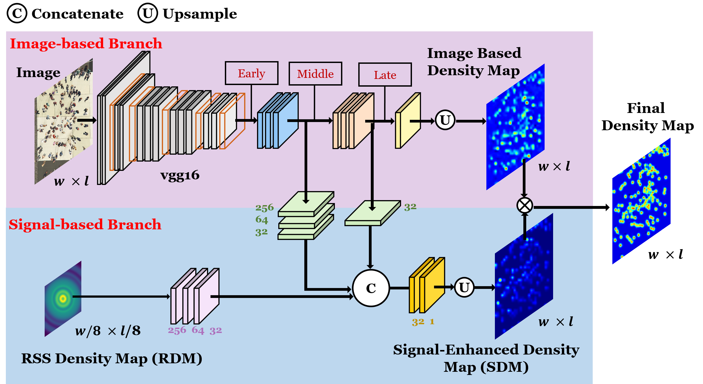
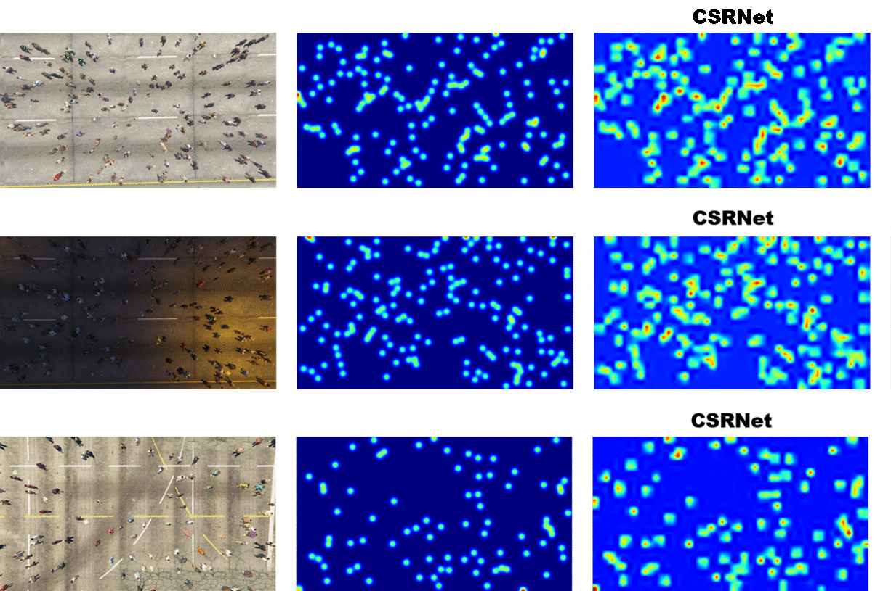
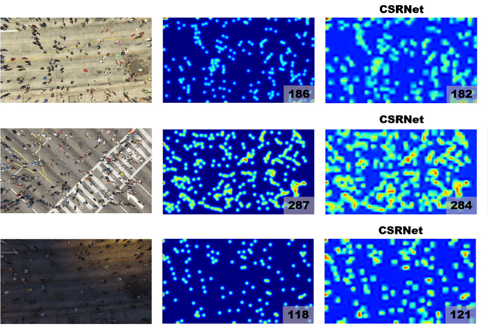
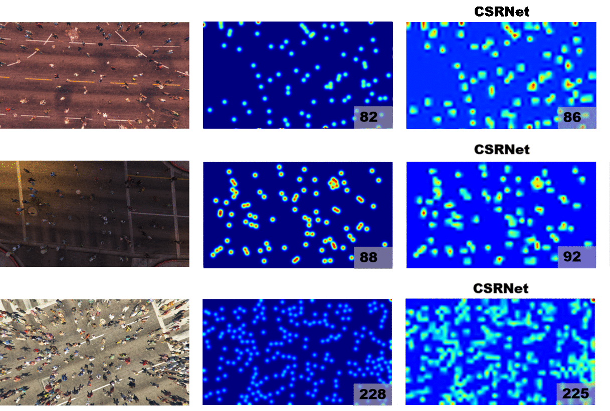

# Improving Crowd Density Estimation By Fusing Aerial Images And Radio Signals
### ACM MM crowd density estimation paper

A recent line of research focus on crowd density estimation from RGB images due to a variety of applications, e.g., surveillance, flow control. However, the performance drops for low-quality images, occlusion, or poor light conditions. On the other hand, people are equipped with various wireless devices, while the received signal strength (RSS) can be easily collected at the base station. As such, another line of research utilizes RSS for crowd counting. Nevertheless, RSS only offers the information of the number of people, while the accurate density map cannot be derived. As UAVs are now treated as flying base stations and equipped with cameras, we make the first attempt to leverage both RGB images and RSS for crowd density estimation on UAVs. Specifically, we propose a novel network to effectively fuse the RGB images and RSS information. Moreover, we design a new loss function that considers the uncertainty from RSS and makes the prediction consistent with the received signals. Experimental results manifest that the proposed method successfully helps break the limit of traditional crowd density estimation methods and achieves state-of-the-art performance.

The proposed network structure, the **RIFNet**, is shown is the following figure:

The generated density maps are shown in the following GIF pictures: ( "+RSS" means fusing the traditional image-based approach with information of Recieved Signal Strength )
---

---

---

---

    <b>1st column</b>: input image &emsp; &emsp; &emsp; 
    <b>2nd column</b>: ground truth &emsp; &emsp;
    <b>3rd column</b>: estimated density map 

To see our UAV-GCC datatset, please click [here](https://drive.google.com/file/d/15M4ilkA_3S9T98iWsXi2MxSfM2KsoboQ/view?usp=sharing).

To see the training data of CycleGAN which is used to tranlate synthetic images, please click [here](https://drive.google.com/file/d/1un6KhXe66W3AXHY1d5HQoQCLNpiCcX4c/view?usp=sharing).
